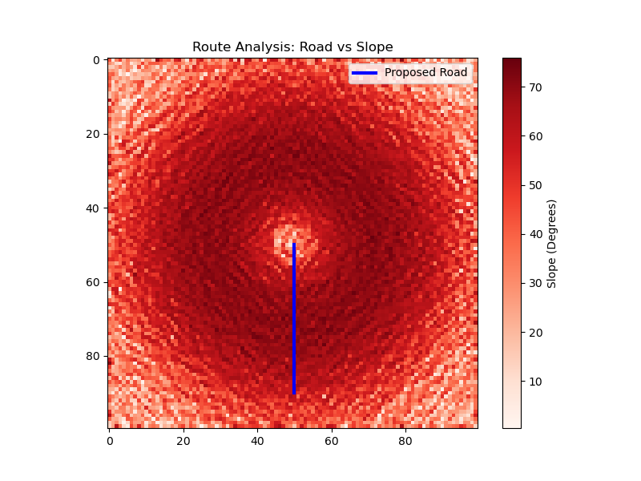

# Catchment Yield & Infrastructure Feasibility Audit

### 🚨 Mission Objective
To automate the preliminary siting analysis for hydropower infrastructure by quantifying hydrological yield (Revenue Potential) and access road traversability (Construction Risk) using geospatial data.

### 🗺️ The Analysis


### 🛠️ Tech Stack
*   **Engine:** Python 3.11 (Conda Environment)
*   **Geospatial Core:** GeoPandas, Shapely
*   **Raster Analysis:** Rasterio, NumPy (Gradient/Aspect Physics)
*   **Visualization:** Matplotlib

### ⚙️ Engineering Logic
1.  **Terrain Generation:** Constructed a synthetic Digital Elevation Model (DEM) using Gaussian distribution to simulate mountainous terrain.
2.  **Hydrological Modeling:**
    *   Calculated **Flow Direction (Aspect)** using vector gradients $arctan(-dy, -dx)$.
    *   Modeled **Runoff Yield** using the Rational Method ($Q = C \cdot I \cdot A$) with variable land-use coefficients.
3.  **Infrastructure Risk:**
    *   Performed Vector-on-Raster sampling to extract slope profiles along a proposed access route.
    *   Applied a critical safety threshold (**>15°**) to determine fleet traversability.

### 🚀 How to Run
1.  Clone the repository.
2.  Create the Conda environment (Required for GDAL/Rasterio binaries):
    ```bash
    conda env create -f environment.yml
    conda activate geospa_env
    ```
3.  Execute the pipeline:
    ```bash
    python src/main.py
    ```

### 📊 Results
*   **Total Catchment Rain Input:** 100,000 m³
*   **Net Water Yield (Runoff):** **42,810 m³**
*   **Max Road Grade:** **72.91°** (Critical Failure)
*   **Project Verdict:** **⛔ ROAD UNSAFE. DO NOT BUILD.**

### 📂 Data Provenance
*   **Source:** Synthetic Gaussian Terrain Generator (Internal Physics Engine)
*   **Resolution:** 10m x 10m Grid
*   **Coordinate System:** Local Cartesian (Matrix Logic)
